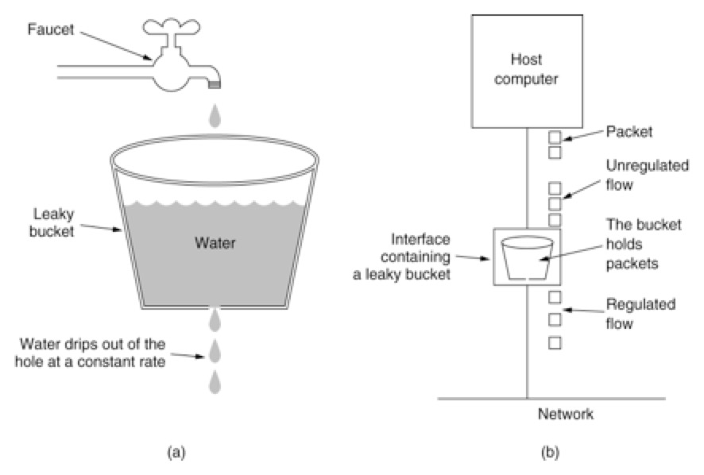
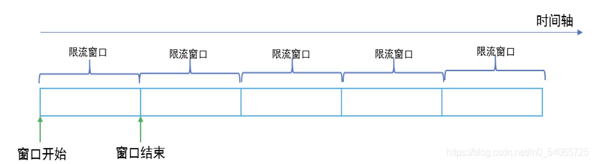
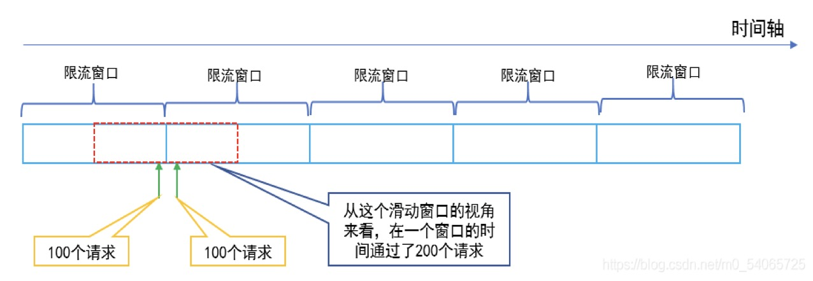
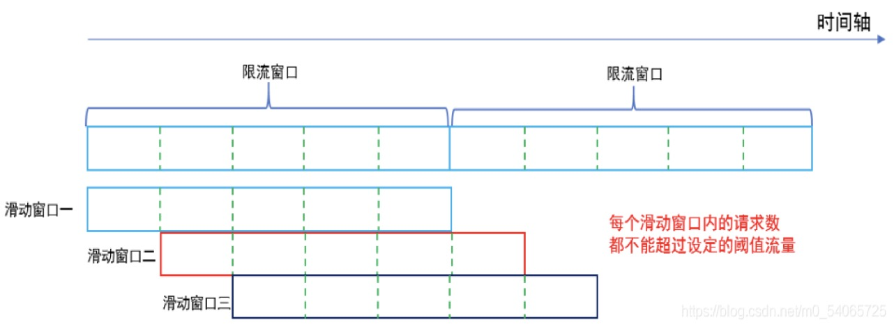
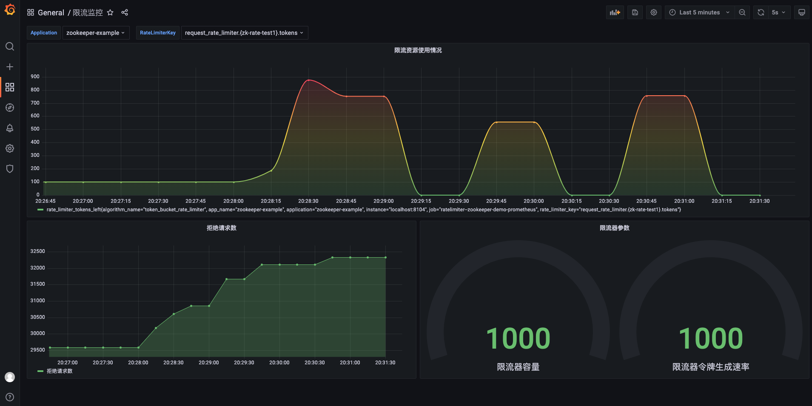
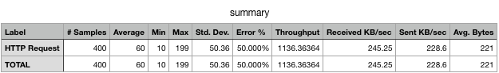
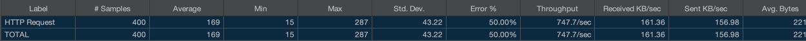

# 基于分布式配置中心的Redis的轻量级分布式限流组件


## 特点

- 轻量级，限流核心基于Redis Lua脚本实现

- 支持令牌桶、漏桶、滑动窗口限流算法

- 支持Naco配置中心配置限流指标

- 支持Spel表达式，能够实现多维度限流

- 自定义SPI机制，相比于Java的标准SPI，其更加灵活，带有自定义注解来加载特定的类，具有缓存功能

- 支持通过Prometheus + grafana对限流情况进行观察

## 算法介绍

### 令牌桶算法

- 系统以恒定的速率产生令牌，然后将令牌放入令牌桶中。
- 令牌桶有一个容量，当令牌桶满了的时候，再向其中放入的令牌就会被丢弃。
- 每次一个请求过来，需要从令牌桶中获取一个令牌，如果有令牌，则提供服务；如果没有令牌，则拒绝服务。


特点：

- 能够限制调用的平均速率
- 允许一定程度的突发调用

### 漏桶算法

水（请求）先进入到漏桶里，漏桶以一定的速度出水，当水流入速度过大会直接溢出（拒绝服务）



缺点：

- 无法面对突发的大流量
- 无法有效利用网络资源

### 计数器滑动窗口算法

说到`计数器滑动窗口算法`，先来介绍一下`计数器固定窗口算法`，该算法如下：

通过维护一个单位时间内的计数值，每当一个请求通过时，就将计数值加1，当计数值超过预先设定的阈值时，就拒绝单位时间内的其他请求。如果单位时间已经结束，则将计数器清零，开启下一轮的计数。



`计数器固定窗口算法`有一个缺点，就是在窗口切换时可能会产生两倍于阈值流量的请求，如下图：



`计数器滑动窗口算法`是`计数器固定窗口算法`的改进，解决了固定窗口切换时可能会产生两倍于阈值流量请求的缺点



### 限流算法总结

- 计数器固定窗口算法：
  实现简单，容易理解，但是在窗口切换时可能会产生两倍于阈值流量的请求。
- 计数器滑动窗口算法：
  作为计数器固定窗口算法的一种改进，有效解决了窗口切换时可能会产生两倍于阈值流量请求的问题
- 漏桶算法：
  能够对流量起到整流的作用，让随机不稳定的流量以固定的速率流出，但是不能解决流量突发的问题。
- 令牌桶算法：
  作为漏桶算法的一种改进，除了能够起到平滑流量的作用，还允许一定程度的流量突发。
  
## 快速开始

rate-limiter限流组件核心配置介绍，参考的配置格式为properties，yml或yaml格式同理

- algorithmName：支持的限流算法，配置值如下：

1. concurrent_request_rate_limiter（高并发限流算法）
2. token_bucket_rate_limiter（令牌桶算法）
3. leaky_bucket_rate_limiter（漏桶算法）
4. sliding_window_rate_limiter（滑动窗口算法）

- redis-config.url：redis配置
- redis-config.database：redis db编号
- config-type：配置文件格式，支持properties，yaml，yml
- rateLimiterKey：限流的key，与接口注解的key保持一致
- expressionType：表达式类型，多维度限流的支持，默认是spel表达式，目前只支持spel表达式

```properties
# redis库编号
spring.ratelimiter.redis-config.database=0
# redis地址
spring.ratelimiter.redis-config.url=127.0.0.1
spring.ratelimiter.config-type=properties
# 限流算法名
spring.ratelimiter.rate-limiter-configs[0].algorithmName=sliding_window_rate_limiter
# 容量
spring.ratelimiter.rate-limiter-configs[0].capacity=200
# 令牌生成速率
spring.ratelimiter.rate-limiter-configs[0].rate=200
# 限流key
spring.ratelimiter.rate-limiter-configs[0].rateLimiterKey=zk-rate-test1
# 表达式 spel
spring.ratelimiter.rate-limiter-configs[0].expressionType=spel
```

### Spring Boot应用接入

可参考lightweight-rate-limiter-example/springboot-example工程

未使用分布式配置中心的springboot接入

- pom依赖应用

```xml
<dependency>
    <groupId>io.llsfish.ratelimiter</groupId>
    <artifactId>ratelimiter-spring-boot-starter-common</artifactId>
    <version>1.0-SNAPSHOT</version>
</dependency>
```

- application.yml

```yaml
server:
  port: 8103
spring:
  ratelimiter:
    redis-config:
      url: 127.0.0.1
      database: 0
    rate-limiter-configs:
      - algorithmName: token_bucket_rate_limiter
        rateLimiterKey : key1
        capacity: 1000
        rate: 200
        expressionType: spel
      - algorithmName: token_bucket_rate_limiter
        rateLimiterKey: "'/Rate/spelTest:' + #args[0].userId"
        capacity: 1000
        rate: 200
        expressionType: spel
```

- 代码中使用

```java
@RestController()
public class TestController {

    @GetMapping("/Rate/rateTest")
    @RateLimiter(key = "key1", clazz = RateLimiterResponse.class)
    public String rateTest() {
        return "111";
    }

    @PostMapping("/Rate/spelTest")
    @RateLimiter(key = "'/Rate/spelTest:' + #args[0].userId", clazz = RateLimiterResponse1.class)
    public Response<String> spelTest(@RequestBody Request request) {
        return new Response<>("0000", "成功", "success");
    }
}

### Nacos配置中心的Spring Boot应用接入

可参考lightweight-rate-limiter-example/nacos-example工程

- pom依赖引用

```xml
<dependency>
    <groupId>io.llsfish.ratelimiter</groupId>
    <artifactId>ratelimiter-spring-boot-starter-nacos</artifactId>
    <version>1.0-SNAPSHOT</version>
</dependency>
```

- application.yml配置

```yaml
server:
  port: 8106

spring:
  application:
    name: nacos-example
  profiles:
    active: dev

nacos:
  config:
    server-addr: 127.0.0.1:8848
    type: yaml
    data-id: nacos-example-dev.yml
    auto-refresh: true
    group: DEFAULT_GROUP
    bootstrap:
      enable: true
      log-enable: true
```

- Nacos配置中心配置文件nacos-example-dev.yml配置内容：

```yaml
# nacos配置示例
spring:
  ratelimiter:
    redis-config:
      url: 127.0.0.1
      database: 0
    rate-limiter-configs:
      - algorithmName: token_bucket_rate_limiter
        rateLimiterKey : nacos-rate-test1
        capacity: 100
        rate: 10
        expressionType: spel
      - algorithmName: sliding_window_rate_limiter
        rateLimiterKey: "'/nacos-rate/test2:' + #args[0].userId"
        capacity: 1000
        rate: 200
        expressionType: spel
```

### Nacos配置中心的Spring Cloud应用接入

可参考lightweight-rate-limiter-example/cloud-nacos-example工程

- pom依赖引用

```xml
<dependency>
    <groupId>io.llsfish.ratelimiter</groupId>
    <artifactId>ratelimiter-spring-boot-starter-cloud-nacos</artifactId>
    <version>1.0-SNAPSHOT</version>
</dependency>
```

- bootstrap.yml配置

```yaml
server:
  port: 8107

spring:
  application:
    name: cloud-nacos-example
  profiles:
    active: dev
  cloud:
    nacos:
      config:
        server-addr: 127.0.0.1:8848
        file-extension: yaml
        refresh-enabled: true
        extension-configs:
          - dataId: cloud-nacos-example-dev.yml
            group: DEFAULT_GROUP
            refresh: true
```

- Nacos配置中心配置文件cloud-nacos-example-dev.yml配置内容：

```yaml
# nacos配置示例
spring:
  ratelimiter:
    redis-config:
      url: 127.0.0.1
      database: 0
    rate-limiter-configs:
      - algorithmName: token_bucket_rate_limiter
        rateLimiterKey : nacos-rate-test1
        capacity: 1000
        rate: 10
        expressionType: spel
      - algorithmName: sliding_window_rate_limiter
        rateLimiterKey: "'/nacos-rate/test2:' + #args[0].userId"
        capacity: 1000
        rate: 200
        expressionType: spel

## 可观测性

### Prometheus + Grafana可观测性支持
 
- pom配置

增加prometheus依赖

```xml
  <dependency>
      <groupId>io.micrometer</groupId>
      <artifactId>micrometer-registry-prometheus</artifactId>
      <version>1.6.4</version>
  </dependency>
  
  <dependency>
      <groupId>org.springframework.boot</groupId>
      <artifactId>spring-boot-starter-actuator</artifactId>
  </dependency>
```

- application.yml配置

```yaml
# 对接prometheus
management:
  metrics:
    tags:
      application: ${spring.application.name}
  endpoints:
    web:
      exposure:
        include: '*'
```

- Prometheus端服务发现配置

修改prometheus.yml文件，在`scrape_configs`标签下增加指标拉取配置`job`ratelimiter--zookeeper-demo-prometheus

```yaml
# my global config
global:
  scrape_interval: 15s # Set the scrape interval to every 15 seconds. Default is every 1 minute.
  evaluation_interval: 15s # Evaluate rules every 15 seconds. The default is every 1 minute.
  # scrape_timeout is set to the global default (10s).

# Alertmanager configuration
alerting:
  alertmanagers:
    - static_configs:
        - targets:
          # - alertmanager:9093

# Load rules once and periodically evaluate them according to the global 'evaluation_interval'.
rule_files:
  # - "first_rules.yml"
  # - "second_rules.yml"

# A scrape configuration containing exactly one endpoint to scrape:
# Here it's Prometheus itself.
scrape_configs:
  # The job name is added as a label `job=<job_name>` to any timeseries scraped from this config.
  - job_name: "prometheus"

    # metrics_path defaults to '/metrics'
    # scheme defaults to 'http'.

    static_configs:
      - targets: ["localhost:9090"]
  - job_name: "ratelimiter--zookeeper-demo-prometheus"

    # metrics_path defaults to '/metrics'
    # scheme defaults to 'http'.
    scrape_interval: 5s
    metrics_path: '/actuator/prometheus'
    static_configs:
      - targets: ["localhost:8104"]
```

- 效果图



## 压测

### 令牌桶算法

- 限流指标：

1. rate：200（每秒生成200个令牌）

2. capacity：200（令牌桶容量200个）

- 压测指标：

1. 并发：200

2. 循环次数：2

- 压测结果：

令牌生成速率为200/s，令牌桶容量200，并发200，循环两次，总共400个请求，压测会有50%的请求被限流调，与压测结果一致


### 漏桶算法

- 限流指标：

1. rate：200（每秒通过200个请求）

2. capacity：200（桶最大容量200个）

- 压测指标：

1. 并发：200

2. 循环次数：2

- 压测结果：

每秒通过200个请求，桶的容量为200，压测的指标为200并发循环两次，第一个循环将桶装满，第二个循环全部被限流，与压测结果一致




### 滑动窗口算法

- 限流指标：

1. rate：200（滑动窗口流量阈值，每秒通过200个请求）

2. capacity：200（限流窗口总请求数200个）

3. 滑动窗口数 = capacity / rate

- 压测指标：

1. 并发：200

2. 循环次数：2

- 压测结果：

滑动窗口阈值200，限流窗口200，可知限流窗口数量为1个，一个限流窗口就能通过200请求，所以会有200个请求被限流，符合压测结果


